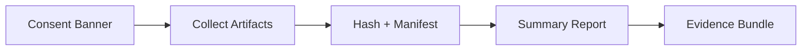
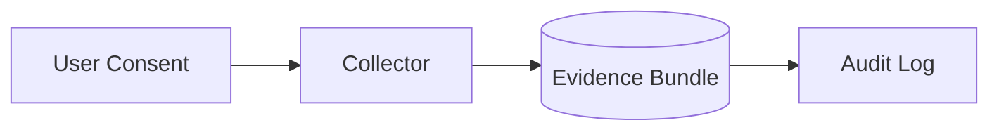

# Baseline Evidence Drop (Public Overview)


Consent-driven evidence collection for GRC assessments. This public repo is a redacted overview focused on evidence workflows and control mapping, without proprietary automation logic or client data.

## What This Is
- Explicit-consent evidence collection
- Hashing and manifest integrity
- Control mapping per artifact

## Framework Alignment
- SOC 2: CC6, CC7
- NIST CSF: ID.AM, PR.AC, PR.DS, DE.CM
- ISO 27001: A.8, A.12, A.18

## Evidence Bundle (Example)
```
/evidence/demo-2026-01-21/
  artifacts/
    os-version.txt
    encryption-status.txt
    firewall-status.txt
  hashes.txt
  manifest.json
  run.log
```

## Evidence Flow (Redacted)



## Threat Model (Redacted)



## Compliance Mapping (Sample)

| Control | Evidence Signal | Purpose |
| --- | --- | --- |
| SOC2 CC7 | Hash manifest | Integrity of evidence |
| NIST PR.DS | Encryption status | Data protection |
| ISO A.12 | Log records | Auditability |

## Example Outputs
- `examples/manifest.example.json`
- `examples/hashes.txt`
- `examples/run.log`

## Key Decisions
- Explicit consent before collection.
- Hashing + manifest for integrity.
- Redacted public outputs to protect IP and privacy.

## Scope and Redaction
- No payloads, secrets, or client artifacts.
- Examples are synthetic and safe for public review.

## Disclaimer
This is a public-safe overview. Do not use as a production payload. No client data, proprietary logic, or real device output is included.
